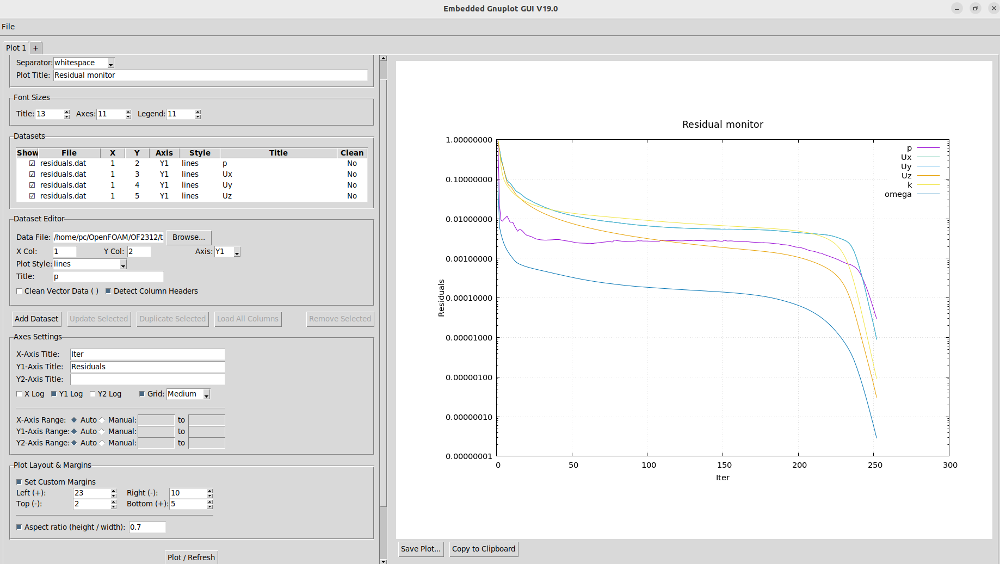

# gnuplot-gui
- A python-tkinter based GUI interface for gnuplot
- Primarily developed to plot/monitor OpenFOAM simulation outputs

# Dependencies

- Built for Python 3.10.12 (can work for newer versions, but check)
- pip based installations that are required are
    - tkinter 8.6
    - Pillow 9.0.1

# Features
- Transient plotting for monitoring convergence of residuals, physical qtys
- Multi-tab window that allows you to manage multiple plots in one instance of the application.
- Save your session and reload it back with plots in all tabs intact.
- Auto detect column headers.
- Cleans files having vector quantities (e.g., velocity) in paranthesis on the fly.
- Supports comma and space as the delimiter (csv file is allowed)
- Show/Hide plots
- XY Axes
    - Secondary Y-axes to plot different quantities in the same plot.
    - Optional log-scale on the axes
    - Custom axes ranges
- Allows standard gnuplot syntax for mathematical operations. e.g., 1:(-$3)
- Adjust plot size through custom margins and aspect ratio
- Customize font sizes for chart title, axes titles, axes labels, and legends

